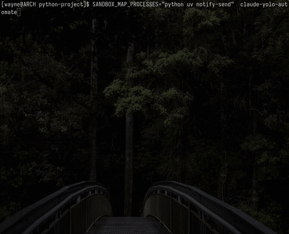

# Ultra-sandbox

> Run Claude Code (or any CLI tool) with `--dangerously-skip-permissions` inside a container, while still using `podman`, `flutter`, `adb`, and other tools **from the host** — transparently.

Ultra-sandbox is a lightweight command-proxy system: a tiny daemon on the host, a frame protocol over a Unix socket, and a drop-in shim that makes container-side commands execute on the host without Docker-in-Docker, SSH tunnels, or privileged containers.

---
## DEMO


## Architecture

```
┌────────────────────────────── HOST ──────────────────────────────┐
│                                                                    │
│    real podman / flutter / adb / …                                 │
│               ▲                                                    │
│               │ fork + exec                                        │
│               │                                                    │
│       ┌───────┴─────────┐                                          │
│       │ sandbox daemon  │   (./sandbox daemon)                     │
│       └───────┬─────────┘                                          │
│               │                                                    │
│               │ frame protocol over Unix socket                    │
│               │ [1B type][2B len BE][payload]                      │
│               │ EXEC / STDIN / STDOUT / STDERR /                   │
│               │ RESIZE / SIGNAL / EXIT                             │
│               │                                                    │
│     .ultra_sandbox/                                                │
│       ├─ daemon.sock        ◄─── bind-mounted into container       │
│       └─ bin/                                                      │
│          ├─ podman   ─► #!/bin/sh exec sandbox run podman "$@"     │
│          ├─ flutter  ─► #!/bin/sh exec sandbox run flutter "$@"    │
│          └─ adb      ─► #!/bin/sh exec sandbox run adb "$@"        │
│                                                                    │
└──────────┬─────────────────────────────────────────────────────────┘
           │  -v .ultra_sandbox:/ultra_sandbox
           │  -v ~/.local/bin/sandbox:/usr/local/bin/sandbox:ro
           │  -e PATH=/ultra_sandbox/bin:$PATH
           │  -e SANDBOX_DIR=/ultra_sandbox
           ▼
┌──────────────────────────── CONTAINER ──────────────────────────┐
│                                                                   │
│   Claude Code (--dangerously-skip-permissions)                    │
│        │                                                          │
│        │ calls `podman build .`                                   │
│        ▼                                                          │
│   /ultra_sandbox/bin/podman   (shim)                              │
│        │                                                          │
│        │ execs  sandbox run podman build .                        │
│        ▼                                                          │
│   /usr/local/bin/sandbox  (client)                                │
│        │                                                          │
│        │ connects to /ultra_sandbox/daemon.sock                   │
│        │ speaks frame protocol                                    │
│        ▼                                                          │
│   → executed on host, output streamed back (full TTY, signals)    │
│                                                                   │
└───────────────────────────────────────────────────────────────────┘
```

**Key idea.** The container never runs `podman` itself. It runs a 3-line shell shim that hands the command to the `sandbox` client, which forwards it to the host daemon over a Unix socket. stdin/stdout/stderr/TTY-resize/signals are all multiplexed on the same socket via a 3-byte framed protocol, so `podman run -it alpine sh` inside the container gives you a real interactive shell on the host.

---

## Quick Start

### 1. Install the `sandbox` binary on the host

Download a prebuilt release for your platform, or build from source.

#### Linux (x86_64)

```bash
curl -L https://github.com/ZenWayne/ultra-sandbox/releases/latest/download/sandbox-linux-x86_64 \
  -o ~/.local/bin/sandbox
chmod +x ~/.local/bin/sandbox
```

Make sure `~/.local/bin` is on your `PATH`.

#### macOS (Apple Silicon)

```bash
curl -L https://github.com/ZenWayne/ultra-sandbox/releases/latest/download/sandbox-darwin-arm64 \
  -o ~/.local/bin/sandbox
chmod +x ~/.local/bin/sandbox
```

> Intel Macs are not covered by prebuilt releases (GitHub's `macos-13` x86_64 runner is being phased out). Build from source — see below.

> macOS runs containers inside a Linux VM (via `podman machine` or Docker Desktop), so `--network=host` targets the **VM**, not your Mac. Install podman before step 2:
> ```bash
> brew install podman
> podman machine init
> podman machine start
> ```

#### Windows (recommended: WSL2)

Open a **WSL2** terminal (Ubuntu/Debian) and follow the **Linux** instructions above. The launcher scripts (`claude-yolo-automate`, `claude-yolo-py-docker.sh`, …) are bash scripts and need a POSIX environment — either WSL2, Git Bash, or MSYS2.

For native Windows use (running `sandbox daemon` standalone, without the Claude launcher scripts), a `sandbox-windows-x86_64.exe` binary is published on the Releases page:

```powershell
# PowerShell
curl.exe -L https://github.com/ZenWayne/ultra-sandbox/releases/latest/download/sandbox-windows-x86_64.exe `
  -o $env:USERPROFILE\.local\bin\sandbox.exe
```

Make sure `%USERPROFILE%\.local\bin` is on your `PATH`.

#### Build from source (any platform)

Requires Rust 1.75+:

```bash
cd ultra-sandbox/sandbox-rs
cargo build --release

# Linux / macOS
install -m 755 target/release/sandbox ~/.local/bin/sandbox

# Windows (PowerShell)
# Copy-Item target\release\sandbox.exe $env:USERPROFILE\.local\bin\sandbox.exe
```

### 2. Build the container image (one-time)

```bash
cd ultra-sandbox
podman build -f claude_code_base.Dockerfile \
    --build-arg HOST_USER_UID=$(id -u) \
    --build-arg HOST_USER_GID=$(id -g) \
    --build-arg HOST_USER_NAME=$USER \
    --build-arg HTTP_PROXY="$HTTP_PROXY" \
    --build-arg HTTPS_PROXY="$HTTPS_PROXY" \
    -t claude_code_base .
```

### 3. Launch Claude Code in any project

```bash
cd /path/to/your/project

# Proxy `podman` from container → host, then start Claude Code.
SANDBOX_MAP_PROCESSES="podman" /path/to/ultra-sandbox/claude-yolo-automate
```

That's it. Inside the container:

```bash
> Can you build the Docker image in this repo?

# Claude runs:
podman build -t myapp .         # ← actually runs on your host
```

- The daemon is auto-started the first time a launcher runs.
- `.ultra_sandbox/daemon.sock` lives under `$HOME/.ultra_sandbox/` by default (override with `SANDBOX_DIR`).
- To proxy more commands, extend the env var: `SANDBOX_MAP_PROCESSES="podman adb flutter"`.

---

## Why Ultra-sandbox

| Problem | Traditional fix | Ultra-sandbox fix |
|---|---|---|
| Need `podman build` inside container | Docker-in-Docker, privileged container | `sandbox map podman` → transparent proxy |
| Need host ADB server for physical device | Mount `/dev/bus/usb`, `--privileged` | `sandbox map adb`, `--network=host` |
| Flutter build pollutes host `build/` dir | Manually clean up | Named volume overlay on `build/` + `.dart_tool/` |
| Claude Code needs session persistence | Re-login every run | `~/.claude` + `~/.claude.json` mounted r/w |
| SSH keys for git but don't want container to touch them | Copy keys into image | `~/.ssh` mounted **read-only** |
| File ownership mismatch (`root` in container, user on host) | `chown -R` after every run | `--userns=keep-id` — host UID/GID preserved |
| Host proxy config (HTTP_PROXY etc.) | Rebuild image with new proxy | `--network=host` + `replace_proxy()` helper |

---

## Launcher scripts

The repo ships four launchers, each with different tradeoffs:

| Script | Image | Mapped commands | Best for |
|---|---|---|---|
| `claude-yolo-automate` | `claude_code_base` | `$SANDBOX_MAP_PROCESSES` (env-driven) | **Any project** — generic, configurable |
| `claude-yolo-py-docker.sh` | `claude_code_py` | `podman` | Python projects (uv, `.venv` overlay) |
| `claude-yolo-flutter-docker.sh` | `claude_code_flutter` | `flutter`, `adb`, `podman` | Flutter + Android device debugging |
| `ultra-sandbox/ultra-sandbox.sh` | `claude_code_base` | — (manual `sandbox map`) | Pure dev shell, no Claude Code |

All four share the same design:

- `--userns=keep-id` — container UID/GID = host UID/GID
- `--network=host` — reuse host proxies, ADB server, podman daemon
- Mount `$WORK_DIR:$WORK_DIR` at the **same path** (Claude sees the project at the same absolute path inside and outside)
- Mount `~/.claude`, `~/.claude.json` r/w — session + auth persistence
- Mount `~/.ssh` **read-only** — git over SSH works, Claude can't exfiltrate keys
- Proxy-rewrite helper: `127.0.0.1:10809` → `host.docker.internal:10809`

### Example: generic launcher with custom command set

```bash
SANDBOX_MAP_PROCESSES="podman adb kubectl" ./claude-yolo-automate
```

The script will:
1. Auto-start the sandbox daemon if not running.
2. Create shims at `$SANDBOX_DIR/bin/{podman,adb,kubectl}`.
3. Launch `claude_code_base` with `.ultra_sandbox/` mounted and `PATH` set.

---

## Pattern: proxying MCP stdio servers whose paths rotate

Some apps ship as AppImages that mount themselves at a randomised path every launch — e.g. [Pencil](https://getpencil.dev/) appears at `/tmp/.mount_Pencil<random>/` and its bundled MCP server lives at `/tmp/.mount_Pencil<random>/resources/app.asar.unpacked/out/mcp-server-linux-x64`. Hardcoding that path into `~/.claude.json` means re-editing it after every restart, and inside a container the FUSE mount isn't even reachable (podman+crun under `--userns=keep-id` can't bind-mount FUSE sources).

The repo ships a tiny dynamic-resolver wrapper, `update-pencil-mcp`, that at exec time scans `/tmp/.mount_Pencil*/resources/app.asar.unpacked/out/mcp-server-linux-x64` and execs the newest match. Point Claude Code at the stable command name and let the wrapper follow the live mount.

### Setup

1. **Install the wrapper on the host.**
   ```bash
   install -m 755 update-pencil-mcp ~/.local/bin/update-pencil-mcp
   ```

2. **Edit `~/.claude.json`** — change the Pencil MCP entry from the absolute FUSE path to the stable command name:
   ```json
   "pencil": {
     "type": "stdio",
     "command": "update-pencil-mcp",
     "args": ["--app", "desktop"]
   }
   ```

3. **Proxy it into the container** — add `update-pencil-mcp` to `SANDBOX_MAP_PROCESSES`:
   ```bash
   SANDBOX_MAP_PROCESSES="update-pencil-mcp podman" ./claude-yolo-automate
   ```

Inside the container, Claude execs `update-pencil-mcp` → shim → host daemon → host wrapper → current MCP binary. stdio is forwarded end-to-end through the frame protocol, so the MCP handshake completes normally **without any bind-mount of `/tmp/.mount_Pencil*`**.

The same pattern generalises to any stdio MCP (or plain CLI) whose binary lives at a path that rotates between runs: drop a small resolver into `~/.local/bin/`, point the config at the stable name, add it to `SANDBOX_MAP_PROCESSES`.

---

## The `sandbox` binary

```
sandbox daemon [--socket PATH]      start the host daemon
sandbox run <cmd> [args...]         execute <cmd> via the daemon
sandbox map <cmd> [--remove]        create/remove a shim in $SANDBOX_DIR/bin/
```

**Environment:** `SANDBOX_DIR` (default `.ultra_sandbox`) controls both the socket path (`$SANDBOX_DIR/daemon.sock`) and the shim directory (`$SANDBOX_DIR/bin/`).

**Cross-platform:** the implementation (`ultra-sandbox/sandbox-rs/`) targets Linux, macOS (x86_64 + arm64), and Windows (via `uds_windows` + ctrlc). CI builds all four in `.github/workflows/build.yml`.

---

## Repository layout

```
ultra-sandbox/                          # repo root
├── .github/workflows/build.yml         # cross-platform CI (linux/mac/win)
├── README.md                           # you are here
├── CLAUDE.md                           # build-and-run notes for Claude Code
│
├── claude-yolo-automate                # generic launcher (env-driven mapping)
├── claude-yolo-py-docker.sh            # Python project launcher
├── claude-yolo-flutter-docker.sh       # Flutter project launcher
├── update-pencil-mcp                   # dynamic resolver for Pencil's rotating MCP path
│
└── ultra-sandbox/
    ├── README.md                       # deeper protocol docs
    ├── ultra-sandbox.sh                # generic dev-shell launcher (no Claude)
    ├── claude-yolo-base-docker.sh      # bare Claude Code launcher (no sandbox)
    ├── claude_code_base.Dockerfile     # debian + Node.js + Claude Code
    ├── ultra-sandbox.Dockerfile        # debian + dev tooling (generic)
    │
    └── sandbox-rs/                     # Rust sandbox (cross-platform, CI-built)
        ├── Cargo.toml
        ├── Cargo.lock
        └── src/main.rs
```

---

## Frame protocol (short reference)

```
frame = | type: u8 | length: u16 BE | payload: [u8; length] |
```

| Direction | Type | Payload |
|---|---|---|
| client → server | `0x01` EXEC | JSON `{cmd, args, cwd, tty, rows, cols}` |
| client → server | `0x02` STDIN | raw bytes |
| client → server | `0x03` RESIZE | `rows: u16 BE, cols: u16 BE` |
| client → server | `0x04` SIGNAL | `sig: u8` |
| client → server | `0x05` EOF | empty |
| server → client | `0x11` STDOUT | raw bytes |
| server → client | `0x12` STDERR | raw bytes |
| server → client | `0x13` EXIT | `code: i32 BE` |

See `ultra-sandbox/README.md` and `ultra-sandbox/sandbox-rs/src/main.rs` for full details.

---

## Troubleshooting

**`sandbox: cannot connect to daemon at ...`**
The daemon isn't running. Start it manually: `sandbox daemon &`. The launcher scripts do this automatically.

**`Error: 'sandbox' not found in PATH`**
You haven't installed the binary to `~/.local/bin/sandbox`. See Quick Start step 1.

**Commands inside the container don't resolve to shims**
Check `PATH` inside the container — it must begin with `/ultra_sandbox/bin`. Use `echo $PATH` to confirm.

**Proxy not reachable from container**
If you use a local HTTP proxy on `127.0.0.1:10809`, the launchers automatically rewrite it to `host.docker.internal:10809`. For other ports, edit `replace_proxy()` in the launcher script.

**Claude session not persisted**
Make sure `~/.claude` and `~/.claude.json` exist on the host before launching. The mounts are r/w, so anything Claude writes there survives container restarts.

**Pencil MCP fails with "no such file" or `WebSocket not connected`**
Pencil's MCP binary lives under `/tmp/.mount_Pencil<random>/`, and the random suffix rotates every launch. Use the bundled `update-pencil-mcp` wrapper and add it to `SANDBOX_MAP_PROCESSES` — see *Pattern: proxying MCP stdio servers whose paths rotate* above.

---

## License

See `LICENSE`.
